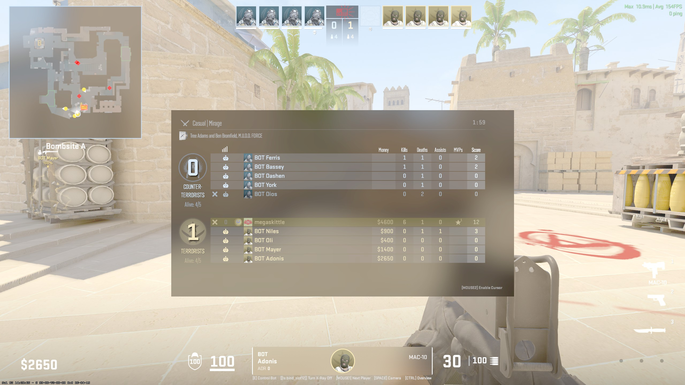

# CS2 Game State Integration Discord Rich Presence

This program uses Counter-Strike 2's Game State Integration (GSI) to display real-time game data on Discord via Rich Presence. It generates an image with the player's current game statistics and updates the Discord Rich Presence accordingly.

## Features

- Displays player game stats (kills, deaths, assists, MVPs, score) on Discord.
- Updates Discord Rich Presence with game mode, map, and team.
- Generates a dynamic image showing game stats for use in Discord Rich Presence.

## Prerequisites

- Python 3.x
- Flask
- pypresence
- Pillow

## Installation

1. Clone the repository:
    ```bash
    git clone https://github.com/KittleCodes/CS2-RPC.git
    cd CS2-RPC
    ```

2. Install the required packages:
    ```bash
    pip install flask pypresence Pillow
    ```

## Configuration

1. Update the `CLIENT_ID` variable in the script with your Discord application's client ID.

2. Ensure that Counter-Strike 2's Game State Integration is configured to send data to your Flask app. You can do this by adding the `gamestate_integration_cs2rpc.cfg` file in the `csgo/cfg` directory

## Usage

1. Run the Flask app:
    ```bash
    python your_script_name.py
    ```

2. Start Counter-Strike 2.

3. The app will update your Discord Rich Presence based on the in-game data received from CS2's Game State Integration.

## Endpoints

- `GET /image`: Returns the generated image showing the player's game stats.
- `POST /`: Receives POST requests from CS2's Game State Integration and updates the Discord Rich Presence.

## Example

- In-game screenshot:

    

- Discord Rich Presence:

    

## License

This project is licensed under the MIT License. See the [LICENSE](LICENSE) file for details.

## Contributing

Contributions are welcome! Please open an issue or submit a pull request for any improvements or bug fixes.

## Acknowledgements

- [Counter-Strike 2](https://www.counter-strike.net/)
- [pypresence](https://github.com/qwertyquerty/pypresence)
- [Pillow](https://pillow.readthedocs.io/)

 

 